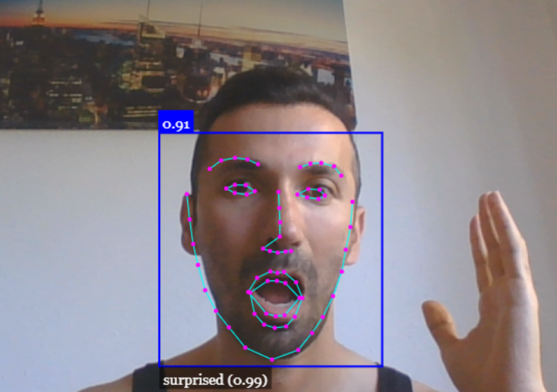
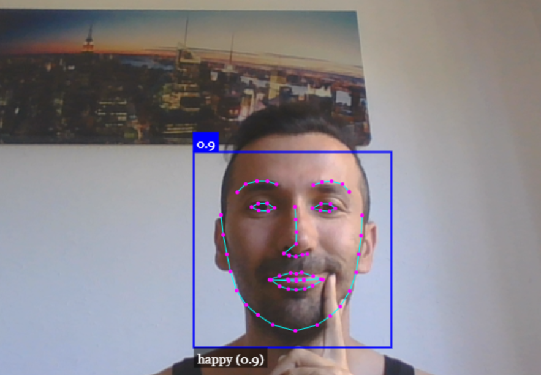

# Face-Detection-JavaScript

JavaScript face recognition API for the browser and nodejs implemented on top of tensorflow.js core (tensorflow/tfjs-core)

# Face recognition with expressions

# Let's try another 

## Source code 
[link](https://github.com/justadudewhohacks/face-api.js)
